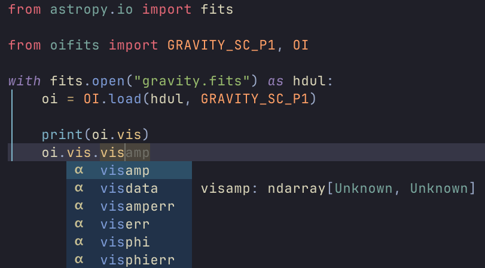

# oifits

A minimal Python library for reading OIFITS files

The library extracts a single, self-consistent interferometric dataset from OIFITS files (e.g. VLTI/GRAVITY products). It is intended as a stable decoding layer for scientific analysis code, not as a full-featured OIFITS framework.

## Quick Start

```python
>>> from astropy.io import fits
>>> from oifits import OI, GRAVITY_FT

>>> hdul = fits.open("gravity_file.fits")
>>> oi = OI.load(hdul, GRAVITY_FT) # EXTVER

>>> print(oi.t3.t3phi)
...

>>> print(oi.vis)

OI_VIS(
  extver    = 20,
  insname   = 'GRAVITY_FT',
  arrname   = 'VLTI',
  mjd       = array(shape=(720,),   dtype='>f8' ),
  sta_index = array(shape=(720, 2), dtype='>i2' ),
  ucoord    = array(shape=(720,),   dtype='>f8' ),
  vcoord    = array(shape=(720,),   dtype='>f8' ),
  flag      = array(shape=(720, 6), dtype='bool'),
  visdata   = array(shape=(720, 6), dtype='>c16'),
  viserr    = array(shape=(720, 6), dtype='>c16'),
  visamp    = array(shape=(720, 6), dtype='>f8' ),
  visamperr = array(shape=(720, 6), dtype='>f8' ),
  visphi    = array(shape=(720, 6), dtype='>f8' ),
  visphierr = array(shape=(720, 6), dtype='>f8' ),
)
```

The object `oi` now contains a single consistent interferometric dataset, offering convenient access to the data and metadata.



## What the Library Does

* Reads OIFITS tables into typed Python objects
* Keeps relevant header metadata
* Provides predictable selection behavior

## Object Model

```
OI
 ├── vis        -> OI_VIS
 ├── t3         -> OI_T3
 ├── flux       -> OI_FLUX
 ├── wavelength -> OI_WAVELENGTH
 └── array      -> OI_ARRAY
```

Each table class is a thin decoder around a FITS `BinTableHDU`.
